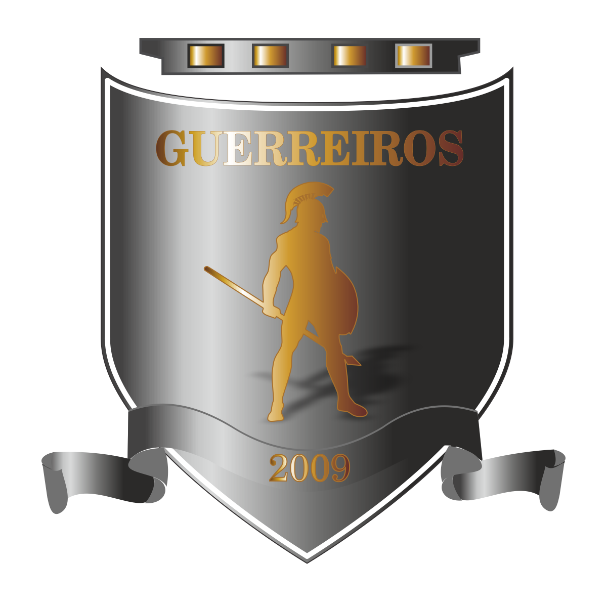

# real-time-game-back-end
<h1 align="center">
  
</h1>

<p align="center">
  <a href="#-tecnologias">Tecnologias</a>&nbsp;&nbsp;&nbsp;|&nbsp;&nbsp;&nbsp;
  <a href="#-projeto">Projeto</a>&nbsp;&nbsp;&nbsp;|&nbsp;&nbsp;&nbsp;
  <a href="#-layout">Layout</a>&nbsp;&nbsp;&nbsp;|&nbsp;&nbsp;&nbsp;
  <a href="#memo-licença">Licença</a>
</p>

## 🚀 Tecnologias

- Node.js
- Express
- MongoDB

## 💻 Projeto

real-time-gamer-mobile é uma sistema para um time amador poder transmitir jogos, divulgar patrocinadores e mostrar tudo relacionado ao time por meio de um aplicativo.

## start
Na raiz do projeto executar o comando
```
npm install
```
Para instalar as dependências.
Após isso, executar o comando:
```
expo start
```

## Features
- Cadastrar, editar e deletar jogos;
- fazer listagem de eventos dos jogos;

## Contributions
Contribuições para o projeto são sempre bem-vindas.

## License
Não se aplica.

## Author
Feito por Junior Teixeira, entre em contato!

</img>

[](https://www.linkedin.com/in/gilvan-carlos/) 
[](mailto:juniorteixeira1805@gmail.com)
